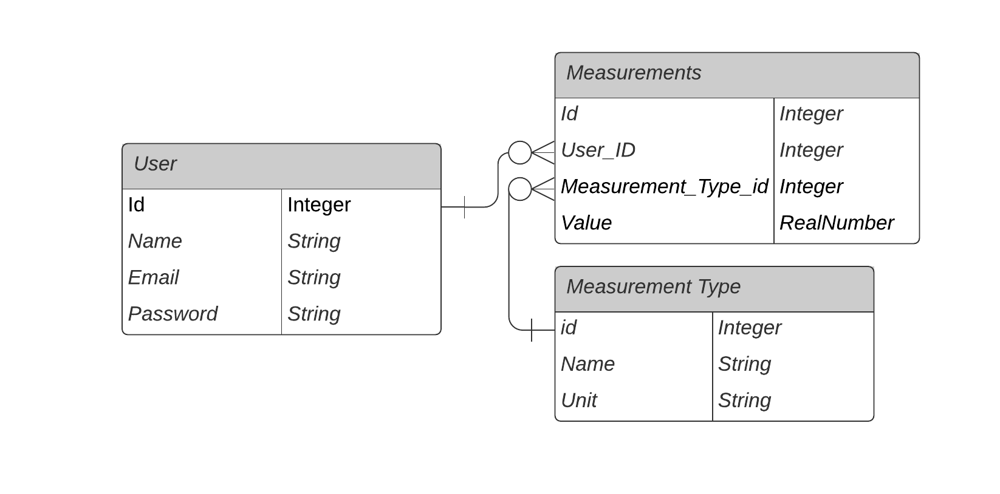

# Tracking API

Tracking API is a RESTful API that allow authenticated users to gather data from it. Built for: [Tracking Front](https://github.com/kazumaki/tracking-front)

## Database ERD



## Live Version

[Live Version](http://vinic-tracking-api.herokuapp.com/)

## Getting Started

Clone the repository into your local computer.

```
$ git clone https://github.com/kazumaki/tracking-api.git
```

### Installing

#### Pre requirements

* Ruby 2.6.3
* Rails 6.0.2

#### Start installation

Install all gems:

```
$ bundle install
```

Database creation and migration

```
$ rails db:create db:migrate db:seed
```

Start API development server

```
$ rails s -p 3001
```

### Testing

Run test command

```
$ bundle exec rspec
```

## Built With

* [Ruby](https://www.ruby-lang.org/en/) - Programming language used
* [Ruby on Rails](https://rubyonrails.org/) - Framework

## Author

👤 **Vinicius Campos Carvalho**

<a href="https://github.com/kazumaki" rel="noopener noreferrer" target="_blank">

   

</a>

- Github: [@kazumaki](https://github.com/kazumaki)
- Twitter: [@iKazumaki](https://twitter.com/iKazumaki)
- Linkedin: [Vinicius Campos Carvalho](https://www.linkedin.com/in/vcamposcarvalho/)
- Email: [vcampos.pitangui@gmail.com](vcampos.pitangui@gmail.com)

<a href="https://github.com/kazumaki" rel="noopener noreferrer" target="_blank">
